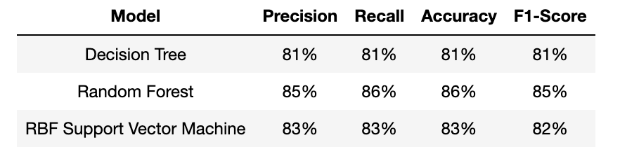
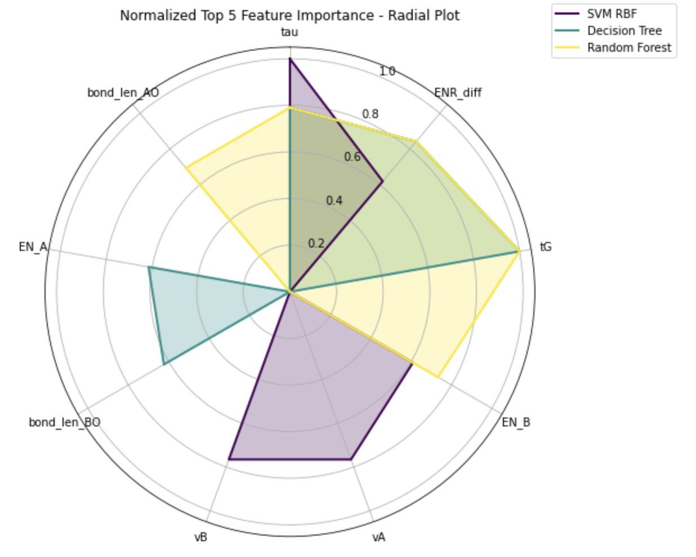

# Machine Learning Molecule Structure Predictor: Perovskite Classification

This project was completed as the final Phase 3 assessment in the Flatiron School’s Data Science Bootcamp. 

Analysis by Erin Wasserman, April 2024

# Overview

This project explores different machine learning algorithms to predict the lowest distortion in perovskite structures, which is a critical aspect in ceramic science, materials physics, and solid-state inorganic chemistry. Researchers have identified a total of 73 elements in the A and B cation sites of ABO3 structures, leading to numerous oxides of the perovskite type.

The objective is to develop models capable of accurately classifying perovskite structures based on features such as electronegativity, ionic radius, valence, and bond lengths of A-O and B-O pairs, thereby aiding in the prediction and optimization of material properties. Model performance is assessed using the Accuracy Score metric.

# Business Problem

A Research Laboratory has asked for an analysis of a dataset to help understand the relationships between various physical and chemical properties of perovskite materials and their crystal structure types. 

Based on this analysis, the following recommendations are made:

- Utilize the Random Forest model.
- Enhance dataset with additional empirical data.
- Address missing values and discrepancies using insights from feature importance analysis to ensure data quality.
- Strategically target discrete values: Leverage RBF SVM's proficiency in capturing nonlinear relationships to target molecules with discrete values for improved predictive accuracy.

# Data Understanding

**Dataset Description**

[Kaggle Crystal Structure Dataset] (https://www.kaggle.com/datasets/meetnagadia/crystal-structure-dataset/data). Each record represents a different Perovskite structures based on their characteristics. The data consists of 4,165 ABO3 perovskite-type oxides. Each observation is described by 13 feature columns and 1 class column which identifies it to be either a cubic, tetragonal, orthorhombic, and rhombohedral structure.

**Data Features**

List of Feature (or attributes, either work) Descriptions

- vA : Valence of A
- vB : Valence of B
- r_A6 : ionic radius of A cation (A6)
- r_A12 : ionic radius of A cation (a second one, A12)
- r_B6 : ionic radius of B cation
- EN_A : Average electronegativity value of A cation
- EN_B : Average electronegativity value of B cation
- bond_len_AO : Bond length of A-O pair
- bond_len_BO : Bond length of B-O pair
- ENR_diff : Electronegativity difference with radius
- tG : Goldschmidt tolerance factor
- tau : New tolerance factor
- mu : Octahedral factor

**Data Splits**

- The dataset was randomly split into training (80%) and test (20%) sets to evaluate model performance.
- Kfold Stratified crossvalidation was use to ensure that each class of the target variable is represented proportionally in each split.

**Data Quality Issues**

- No significant data quality issues were identified in the dataset.
- Nonphysical data was identified and removed using domain knowledge.

**Data Licensing and Usage**

- [Database: Open Database, Contents: Copyright Original Authors](https://opendatacommons.org/licenses/odbl/1-0/)


# Methodology

## Data Preparation

**Data Cleaning and Preprocessing**
- Missing values and placeholders were identified and removed from the dataset.
- Histograms, Correlation Plots, and Pair plots were used to inform data cleaning.

## Modeling

- Decision Tree
- Random Forest
- Support Vector Machine

# Evaluation

- Kfold Cross-validation
- Accuracy
- Comparison Table

## Limitations

- More detailed explanation of the feature variables would have maximized the data cleaning.
- An accruacy of 100% was not achieved.

# Key Findings

<br>


<table>
  <tr>
    <th>Rank</th>
    <th>Decision Tree</th>
    <th>Random Forest</th>
    <th>RBF SVM</th>
  </tr>
  <tr>
    <td>1</td>
    <td>tG</td>
    <td>tG</td>
    <td>tau</td>
  </tr>
  <tr>
    <td>2</td>
    <td>tau</td>
    <td>ENR_diff</td>
    <td>vA</td>
  </tr>
   <tr>
    <td>3</td>
    <td>ENR_diff</td>
    <td>tau</td>
    <td>vB</td>
  </tr>
   <tr>
    <td>4</td>
    <td>bond_len_BO</td>
    <td>EN_B</td>
    <td>EN_B</td>
  </tr>
   <tr>
    <td>5</td>
    <td>EN_A</td>
    <td>bond_len_AO</td>
    <td>ENR_diff</td>
  </tr>
</table>
*Radial Basis Function Kernel Support Vector Machine (RBF SVM)

## Actionable Insights

<ol>
<li> Utilize the Random Forest model.
<li>Enhance dataset with additional empirical data.
<li>Address missing values and discrepancies using insights from feature importance analysis to ensure data quality.
<li>Strategically target discrete values: Leverage RBF SVM's proficiency in capturing nonlinear relationships to target molecules with discrete values for improved predictive accuracy.

</ol>

## Next Steps

 There are several directions that could be explored in the next phase of this project.
<ol>
<li>Gather Additional Empirical Data:

- Focus on collecting empirical data, especially experimental data related to molecular structures. Bond lengths, bond angles, valences are critical empirical parameters.
- Consider expanding the dataset to include a wide range of molecular structures and variations to capture diverse structural characteristics.

<li>Improve Electronegativity and Ionic Radius Estimates:

- Investigate methods to improve the accuracy of electronegativity and ionic radius estimates using data-driven approaches. Machine learning models can be trained to refine and optimize these parameters based on observed structural characteristics.
- Assess the impact of adjusted electronegativity and ionic radius values on predictive model performance and molecular structure determination.

<li>Feature Segmentation:

- Utilize unsupervised machine learning techniques like clustering to identify patterns and group similar molecular structures. This can help in segmenting the dataset into distinct clusters without relying on labeled data.
- Explore the use of clustering algorithms such as K-means or hierarchical clustering to identify structural similarities and differences.

<li>Utilize Structural Parameters for Prediction:

- Leverage structural parameters such as tG, tau, and mu to predict molecular properties and behaviors. These parameters can serve as valuable predictors in machine learning models.
- Explore existing relationships between structural parameters and molecular properties, and consider incorporating them into the feature set for predictive modeling.

<li>Deep Learning:

- Investigate the application of deep learning models, such as neural networks, for molecular structure determination. Deep learning techniques can effectively capture complex relationships and patterns in the data.
- Explore the use of deep learning architectures like convolutional neural networks (CNNs) or recurrent neural networks (RNNs) for feature extraction and classification tasks.

<li>Analyze Halides for Big Data Processing:

- Explore the inclusion of halides in the dataset for big data processing and analysis. Investigate how variations in halide compositions contribute to structural diversity and affect predictive model outcomes.
- Consider incorporating halide-specific features or parameters into the dataset to enhance the predictive capabilities of machine learning models.
</ol>    

These next steps aim to address identified inconsistencies, enhance the robustness of the analysis, and provide more actionable insights for the researcher's decision-making processes.

# Author

Name: Erin Wasserman

GitHub: [Cellister](https://github.com/cellister)

Email address: cellister at gmail .com

# Repository Structure

* **Jupyter Notebook**

The [Jupyter Notebook](https://github.com/cellister/ML_Molecule_Structure_Predictor/blob/main/Project_PDFs/ML_Molecular_Structure_Predictor%20-%20Jupyter%20Notebook.pdf) is the key deliverable and contains the details of my data strategy, methodology, data cleaning, visualizations, and actionable insights.

* **Presentation**

This 5-7 minute, non-technical [presentation](https://github.com/cellister/Film-Investment-Analysis-Project/blob/main/Report%20PDFs/Erin_Wasserman_presentation_PDF_P2.pdf) was made in [Canva](https://www.canva.com/design/DAGAhemjCqQ/SC9XjPt87gS8cgYyPIWb5Q/edit?utm_content=DAGAhemjCqQ&utm_campaign=designshare&utm_medium=link2&utm_source=sharebutton) and gives an impactful and brief overview of the key insights and recommendations. 

* **Data**

The data used in this analysis can be found in the ‘Data’ folder. Some data can be found on the [Kaggle Dataset](https://www.kaggle.com/datasets/meetnagadia/crystal-structure-dataset/data).

```

├── Photos
│   ├── Other
│   ├── EDA
│   ├── SVM
│   ├── Random_Forest
│   └── Decision_Tree
├── Data
|   ├── Perovskite_train.csv
│   ├── Perovskite_test.csv
├── Project_PDFs
│   ├── ML_Molecule_Structure_Predictor.pdf
│   ├── ML_Molecule_Structure_Predictor.pdf
│   └── github_repository.pdf
├── .gitignore
├── ML_Molecule_Structure_Predictor.ipynb
└── README.md
```


